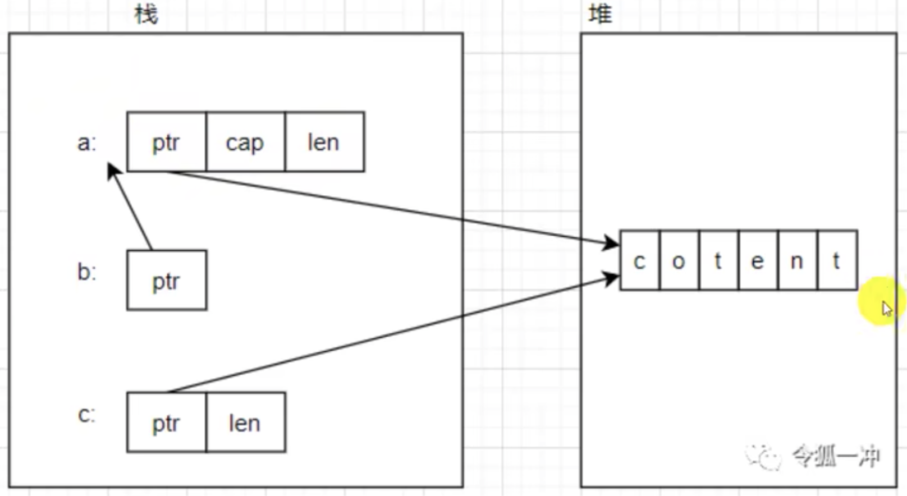

# 以借用类型为参数
编码时应该总是倾向于使用借用类型（borrowed type）而不是借用所有类型（borrowing the owned type）
例如 &str 而非 &String, &[T] 而非 &Vec<T>, 或者 &T 而非 &Box<T>

为什么要这么做？
原因1：使用借用类型可以避免已经提供一层间接性的所有类型上的多层间接：
```rs
let a: String = "content".to_string();
let b: &String = &a;
let c: &str = a.as_str();
```
变量在内存中分布如下：


结合上图，有以下理解：
- String 类型具有一层间接，因为 String 类型是一个有三个字段的胖指针
- &String 具有两层引用，在 String 的基础上加了 & ，所以 b 实际上指向 a 而不是堆上的内容
- &str 也是一个胖指针，直接指向堆上的内容


结合书中的例子，也就是说，在确定参数类型时，要考虑类型转换的效率和影响以及类型的兼容性


# 使用 format! 串联字符串
对于一个可变的 String 类型，可以使用 push、push_str 方法改变它，或使用 + 连接字符串，然而，使用 format! 会更方便

但他不是效率最高的连接字符串的方法，push 操作通常是最有效率的（尤其这个字符串已经预先分配了足够的空间）


# 构造器 与 Default
Rust 没有语言层面的构造器，常用一个关联函数 new 创建对象

Default trait 可以实现类型的默认构造器，可以使用宏或手动实现
```rs
#[derive(Default)]
struct MyStruct {
  // Option defaults to None
  output: Option<PathBuf>,
  // Vec defaults to empty vector
  search_path: Vec<PathBuf>,
  // bool defaults to false
  check: bool,
}

fn main() {
  let a = MyStruct::default();
}
```

# 将集合视为智能指针
通过为集合实现 Deref trait，提供其拥有和和借用的数据视图

考虑 Vec，是一个拥有 T 的集合，实现 Deref 完成 &Vec 到 &[T] 的隐式解引用，从而提供借用 T 的集合（&[T]）
```rs
impl<T> Deref for Vec<T> {
  type Target = [T];
  fn deref(&self) -> &[T] {
    unsafe {
      std::slice::from_raw_ptrs(self.ptr.as_ptr(), self.len())
    }
  }
}
```


# 确定性析构
Rust 不提供与 finally 等价的代码块，但一个对象的析构器将会执行在退出前必须执行的代码

```rs
struct A(u8);

impl Drop for A {
  fn drop(&mut self) {
    println!("A exit")
  }
}
```


# 使用 take replace 在修改枚举变体时保持值的所有权
对于枚举类型：
```rs
enum MyEnum {
  A {name: String, x: u8},
  B {name: String},
}
```
使用`std::mem::take()`和`std::mem::replace()`在不克隆 name 的情况下修改 name

```rs
use std::mem;

#[derive(Debug)]
enum MyEnum {
  A {name: String, x: u8},
  B {name: String},
}

fn cover_a_to_b(e: &mut MyEnum) {
  if let MyEnum::A {name, x: 0} = e {
    *e = MyEnum::B {
      name: mem::take(name),
    }
  }
}
```


# 栈上动态分发
```rs
use std::io;
use std::fs;

let (mut stdin_read, mut file_read);

// 运行时确定具体类型
let readable: &mut dyn io::Read = if arg == "-" {
  stdid_read = io::stdin();
  &mut stdin_read
} else {
  file_read = fs::File::open(arg)?;
  &mut file_read
}
```


# 外部语言接口
## FFI中错误处理

todo


# Option 的迭代器
Option 可以作为一个报刊一个0个或1个元素的容器，他实现了 IntoIterator 特性


# 向闭包传递变量
默认情况下，闭包通过借用捕获其环境。再将变量转移到闭包中时，在单独的作用域中使用变量重绑定
```rs
use std::rc::Rc;

let num1 = Rc::new(1);
let num2 = Rc::new(2);
let num3 = Rc::new(3);

let closure = {
  let num2 = num2.clone(); // 重绑定
  let num3 = num3.as_ref();
  move || {
    *num1 + *num2 + *num3;
  }
}
```


# 公共结构体和枚举的类型的可扩展性
在某些情况下，库作者可能想在不破坏向后兼容的情况下，为公共结构体添加公共字段或为公共枚举添加新的变体。在 Rust 中可以使用`#[non_exhaustive]`和添加私有字段的方式来达成
```rs
mod a {
  #[non_exhaustive]
  pub struct S {
    pub name: String,
  }

  #[non_exhaustive]
  pub enum E {
    Va,
    Vb,
    #[non_exhaustive]
    Vc {a: String},
  }
}

pub fn print_matched_a(s: a::S) {
  let a::S {
    name: String, ..
  } = s;
}

// 或者给结构体增加私有成员，这样定义的结构体也不能直接用结构体表达式创建，只能使用包提供的方法，也做到了向后兼容
pub struct S {
  name: String,
  _age: i32,
}

// 在另外的包使用
let s = S {
  name: "qwe".to_string(),
  _age: 12,   // 报错
};
```
不能直接创建这种结构体，要使用结构体包提供的方法


# 临时可变性
对于临时可变的变量，在可变后进行重绑定来明确为不可变的变量
```rs
let mut data = vec![3,5,72,1,6,8,34,6];
data.sort()

let data = data;   // 重绑定，变量变为不可变

```
